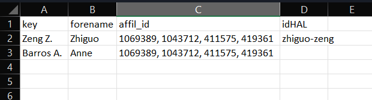

In this section, you will find a step-by-step demo to show you how to use the script to upload the paper metadata from a CSV file, which is created from Scopus. Let us assume you already download the codes and install all the necessary dependencies.

Suppose to prepare the next HCERES evaluation, we need to make sure that all the papers for a research team 'LGI-SR' published between 2020 - 2024 are uploaded in HAL, and the stamps are 'LGI-SR'. 

The major steps are:

1. [Step 1: Search Scopus for the paper metadata](#item-1)
2. [Step 2: Prepare the `data/auth_db.csv` file](#item-2)
3. [Step 3: Prepare the `data/inputs/path_and_perso_data.json` file](#item-3)
4. [Step 4: Change the stamps for the teams](#item-4)
5. [Step 5: Run `test_upload_from_csv.py`](#item-5)


# Step 1: Search Scopus for the paper metadata <a id="item-1"></a>

First, we need to search Scopus for the paper metadata. In this research team, there are three permenant researchers and each of them has their own Scopus-id. So we can easiliy get the required metadata through the following Scopus query:

```
AU-ID(55659850100) OR AU-ID(55348807500) OR AU-ID(7102745133) AND PUBYEAR > 2019 AND PUBYEAR < 2025
```

Then, we output the results to `data/inputs/scopus_results.csv`: Please select "all" and then "export to csv" as follows.


## Step 2: Prepare the `data/auth_db.csv` file <a id="item-2"></a>

The `data/auth_db.csv` file is used to map each author to his/her full name (rather than initials), affiliations id in HAL, and idHAL in HAL. If you don't have the information about the authors in your database, you can skip this step. Otherwise, you need to provide the information in this file. The first column is the author key, it should match the author name field in the Scopus records. 

The format of this file should be the following:



- Notes:
    - The key used to relate the author to the Scopus result is defined as the last name of the author + Initial of the first name. E.g., Zeng Z.
    - The affil_id and idHAL will be used to map the author names and affiliations in HAL. You can search them from [aurehal.](https://aurehal.archives-ouvertes.fr/)

    - __Please note that if an author has different ways of spelling its initials in the Scopus record, you need add multiple entries in this table, each one corresponding to one way of spelling__ An example of auth_db.csv can be found [here.](../data/inputs/auth_db.csv)


## Step 3: Prepare the `data/inputs/path_and_perso_data.json` file. <a id="item-3"></a>

You need to __create__ a file called `path_and_perso_data.json` and put it under the `data/inputs/` folder (it is not included in the repository, as it contains personal credential and is included in .gitignore file. __Please always keep this file offline!__). In this file, you should provide your HAL user names, passwords. The format of this file should be the following:

```json
{
    "perso_login_hal": "your_hal_login",
    "perso_mdp_hal": "your_hal_password",
}
```

Apart from the HAL credentials, you also need to provide your Scopus API key. The first time you run this script, you will be asked to provide your Scopus API key in the terminal.
- You can create your own Scopus API key from [Elsevier Developer Portal](https://dev.elsevier.com/).       


- "perso_scopusInstToken": Scopus API Institutional token. This token will allows you to use scopus API outside your institutional ip range (e.g., at home). You can skip this, but then you can only use the script within your instituional ip address. To get this token, you need to send an email to [Eslevier developer support](https://service.elsevier.com/app/contact/supporthub/dataasaservice/) and ask for it.

## Step 4: Change the stamps for the teams. <a id="item-4"></a>

In this example, we want to upload the papers to HAL with the stamp 'LGI-SR' and 'CHAIRE-RRSC'. So we need to modify the `stamp` variable in the `hal_upload_from_scopus.py` file. 
You should modify the stamps according to your needs. 

```python 
line 14: stamps = ['your_stamp_1']
```

You can find the stamp names for the collections that you are the administrator. To do so, you need to go to the HAL interface, and click on the "My Collection" button on the top right corner. Then, you can find the stamp name as the following.


__Please note that the type of stamp should be a list, i.e., even though you have only one stamp, you need to put it like `stamp=['XXX']`.__

## Step 5: Run `test_upload_from_csv.py` <a id="item-5"></a>

Finally, we can run the `test_upload_from_csv.py` script. If everything goes well, you will see the following output in the terminal:


You can check the status of the uploading process in the `data/outputs/log.csv` file. For each paper in `scopus_results.csv`, the program will:
    - Check if this paper already exists in HAL. If yes, the program will skip this paper, and you will see `already in hal` in the log.
    - If not existed, the program will generate a TEI-xml file for this paper. If succeeded, you will see `TEI generated` in the log.
    - Then, the TEI-xml file will be uploaded to HAL. If succeeded, you will see `HAL upload: Success` in the log.

Hope everything will be fine with you! Please feel free to contact me in Github if you have any questions.
